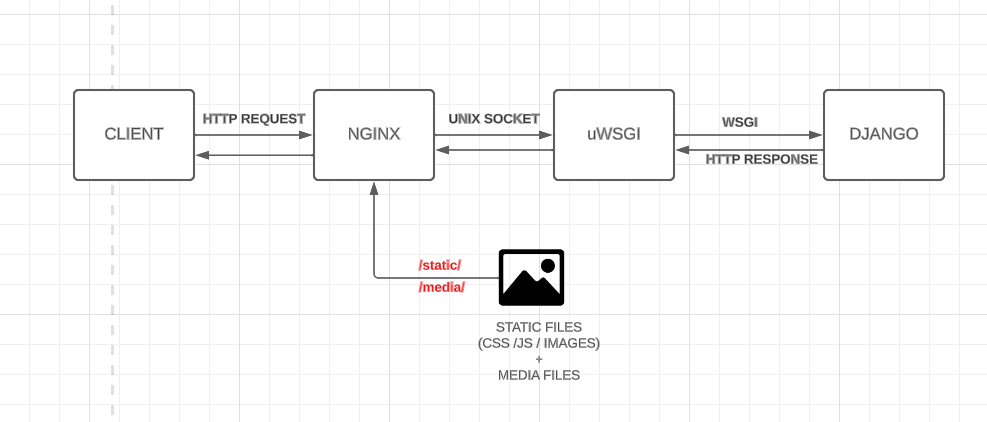

# Django Production Setup 

This is the code repository that I decided to create to offer a Django Production Setup. The technologies that I decided to use to create the setup are:
  - Docker: used to build, deploy and run application containers;
  - PostgreSQL: used as the default database;
  - Nginx: acts as a reverse proxy, receiving HTTP requests and redirecting them to different backend. Also in a website you have not only the dynamic content, but also static files like images, JavaScript files and CSS style sheets and Nginx serve them efficiently;
  - Redis: used as a cache service;
  - uWSGI: a standard web server used to deploy the application in a production environment.

Let's see them in a more detailed way :smiley:

## Structure of the project



This diagram shows the request/response cycle of the production environment:
  1. The NGINX web server receives from the client the HTTP request;
  2. NGINX passes the request received to the uWSGI server using the UNIX socket;
  3. uWSGI passes the request received through the socket from NGINX to Django that will process it;
  4. Django processes the HTTP request and returns the HTTP response back to the NGINX, that returns it to the client. 

The web server NGINX not only serves the request, but also the static and media (the ones that the user maybe can upload) files in production environment. 

## Instructions

These are all the instructions that you need to follow to run the Docker containers and to setup your project for the production environment!

### Run Docker 

There are a few steps needed to run the project: 

    docker-compose build

This command will build or rebuilds images in the docker-compose.yml file that contains all the Dockerfile that will automatically creates containers on the Docker platform.

Then you need to run the following command:

    docker-compose up

This command will start and run an entire application on a standalone host that contains multiple services like Django, Nginx, Cache and Db.

Another useful command is:

    docker-compose down -v

This will stop and remove containers, volumes, networks and images created by the "docker-compose up" command.

You can also run this command:

    docker-compose up --build

This will run both the build and the up docker commands.

### Steps to follow

There are different steps to follow to use this Django production setup:

- As you can see, there's an `.env` file where there are different environment variables defined as follows: 
  - `ADMIN_EMAIL`: it is the email address of the admin user that will be used inside the `prod.py` settings file; if a view raises an exception, Django will send an email containing the error message to the email address specified in it;
  - `POSTGRES_DB, POSTGRES_USER, POSTGRES_PASSWORD`: these are the settings that will be used to create the database credentials (name, name of the user and db's password);
  
  Obviously, when you push the project on github, you need to put this file in the `.gitignore` file, since these are environment variables that you want to be private since they represent sensitive information.

- In `prod.py` settings file, it is present this setting:

    ```
   ALLOWED_HOSTS = ['your-website.com', 'www.your-website.com']
    ```

  With this setting, we are saying to Django which host/domain names the project can serve, it is used to prevent HTTP Host header attacks; you can find more on [Django documentation](https://docs.djangoproject.com/en/4.2/ref/settings/). 
  
  If you already have a fixed IP address in production, you can pass directly in `ALLOWED_HOSTS` the hostname of your website; if not you can pass `localhost`, `127.0.0.1` or a hostname you want to give to your website (like my `your-website.com`). To use this thing of a hostname, you need to follow this step:
    - Edit the `/etc/hosts` file in Linux or macOS adding this line: 
       ```
       127.0.0.1 your-website.com www.your-website.com
       ```
       If you use Windows you need to add this line into the file `C:\Windows\System32\drivers\etc`

 - To handle the static and media files, you need to put in `base.py` file, that is the base settings file that contains the settings that are common for the production and development environments, the `STATIC_URL`, `STATIC_ROOT`, `MEDIA_URL`, and `MEDIA_ROOT` settings:
      ```
      STATIC_URL = 'static/' 
      STATIC_ROOT = os.path.join(BASE_DIR, 'static')

      MEDIA_URL = 'media/'
      MEDIA_ROOT = os.path.join(BASE_DIR, 'media')
      ```
    And in the file containing the configuration for NGINX `config/nginx/default.conf`, you need to pass these settings that will tell NGINX to serve static and media files under the `/static/` and `/media/` paths:

      ```
        location /static/ {
            # location of the static files
            alias /code/django_prod_skeleton/static/;
        }

        location /media/ { 
            # location of the media files
            alias /code/django_prod_skeleton/media/;
        }
      ```

    In this way NGINX will serve directly the static and media files without forwarding the requests to uWSGI.

    To serve the static files, you need to start the docker application running this command:

        docker-compose up
        

    Then, in another shell in the parent directory, run this command:

      ```
      docker-compose exec web python /code/django_prod_skeleton/manage.py collectstatic
      ```

    This is a command that will collects the static files from all the applications of the project and will collect them in the path defined in the `STATIC_ROOT` setting. 
 
 - Before deploying on production the project, you can check its status using the system check framework that Django includes. To do this you need to run the following command:

      ```
      python manage.py check --deploy --settings=django_prod_skeleton.settings.prod
      ```
    This command will return a list of issues that are related to the security settings:

    - One due to the `SECRET_KEY` setting; all you need to do is change that `django-insecure` that is inside of it and put there random characters. Obviously you need to put inside of `.env` file the `SECRET_KEY` value and get it using the `os` library:
          
          SECRET_KEY = os.environ.get('SECRET_KEY')
          
    - The other issues are related to `CSRF_COOKIE_SECURE`, `SESSION_COOKIE_SECURE`, `SECURE_SSL_REDIRECT` and you need to put all three of them to `True`; the first one will use a secure cookie for `CSRF` (Cross Site Request Forgery) protection and will transfer the cookie only over HTTPS. The second one will use a secure session cookie, it will transfer the cookie only over HTTPS and the third one will sent all the HTTP requests only over HTTPS. To know better about them look at the [Django documentation](https://docs.djangoproject.com/en/4.2/ref/settings/)

    - The last issue is related to this setting `SECURE_HSTS_SECONDS`; this setting is due to the HTTP Strict Transport Security policy that prevents from connecting to a site that has an expired, self-signed or invalid [SSL/TLS cerificate](https://aws.amazon.com/it/what-is/ssl-certificate/#:~:text=SSL%2FTLS%20stands%20for%20secure,using%20the%20SSL%2FTLS%20protocol.). This certificate is the one related to the `Transport Layer Security (TLS)` protocol that is the standard used for serving a website with a secure connection. 
    
      If you own a real domain, you need to apply to a `Certificate Authority (CA)` to issue a certificate and you can do that using `Let's Encrypt`, that will give you trusted SSL/TLS certificates for free and you can find everything that you need at this page https://letsencrypt.org/getting-started/ 

      If you don't have a real domain and you want to bypass this issue, there are a few steps that you need to follow to create your own SSL/TLS certificate:
        - First of all, you need to install OpenSSL on your machine and you can do that following this tutorial (for Windows): 
        https://thesecmaster.com/procedure-to-install-openssl-on-the-windows-platform/
        - Once you have installed it, you can create a new certificate and all you need to do is going inside the folder of the project (where you have the `manage.py` file) and run this command: 

        ```
        openssl req -new -newkey rsa:4096 -x509 -sha256 -days 365 -nodes -out MyCertificate.crt -keyout MyKey.key
        ```

        Then you will be prompted to add identifying information to your certificate. You can see a more detailed explanation about it on this page: https://www.linode.com/docs/guides/create-a-self-signed-tls-certificate/
  
  - In the `docker-compose.yml` file, for the `web` service, you can see that in `command`, there are two commands, one that is commented that is one the one that you can use for the development environment and the other one that is related to the production environment. I advise you to use the command with `python manage.py runserver` while you are developing new features, since this will allow you to develop and try new things in a faster way. 

## Credits

I want to thank, for this project, the work done by [Antonio Melé](https://antoniomele.es/) with its incredible book [Django 4 By Example](https://djangobyexample.com/). 

It is thanks to this book that I was able to learn new things and apply them on this project! 


Feel free to tell me things that you think that should be changed and I hope you find this setup project very helpful :smiley:


